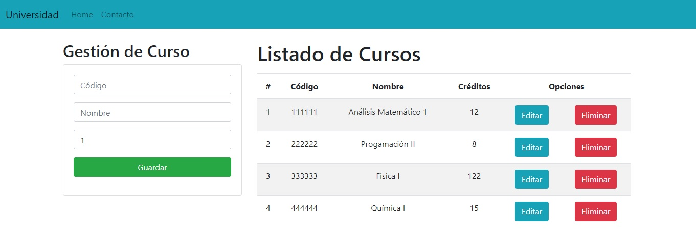

## Índice

* [1. Preámbulo](#1-preámbulo)
* [2. Resumen del proyecto](#2-resumen-del-proyecto)
* [3. Tecnologías Utilizadas](#3-tecnologías-utilizadas)
* [4. Personas Contribuyentes](#4-personas-contribuyentes)
 

***

## 1. Preámbulo

[Python](https://www.python.org/) es un lenguaje de alto nivel de programación interpretado cuya filosofía hace hincapié en la legibilidad de su código. Se trata de un lenguaje de programación multiparadigma, ya que soporta parcialmente la orientación a objetos, programación imperativa y, en menor medida, programación funcional. Es un lenguaje interpretado, dinámico y multiplataforma.
Administrado por Python Software Foundation, posee una licencia de código abierto, denominada Python Software Foundation License.2​ Python se clasifica constantemente como uno de los lenguajes de programación más populares.3

## 2. Resumen del proyecto
"Crud-Curso" es una página web destinada para las universidades en la cual uno va a poder registrar, modificar y eliminar 
los diferentes curso que se dictan en dicho establecimiento.
Este ejemplo de proyecto se llevó a cabo de un video como guía. 
   * Link : https://www.youtube.com/watch?v=uSbDMs7Y9yI

## 3. Tecnologías Utilizadas

Esta son las diferentes tecnologías que se han utilizado para llevar a cabo este proyecto:

* Python 

* Django

* SQLite3

* JavaScript

* HTML 

* Bootstrap 

* CSS 

* Control de Versiones (Git y GitHub)
    * Git: Instalación y configuración
    * Git: Control de versiones con git (init, clone, add, commit, status, push, pull, remote)
    * Git: Integración de cambios entre ramas (branch, checkout, fetch, merge, reset, rebase, tag)
    * GitHub: Creación de cuenta y repos, configuración de llaves SSH
    * GitHub: Despliegue con GitHub Pages

## 4. Personas Contribuyentes

* Sofia A. Soto | Front-End | Argentina

